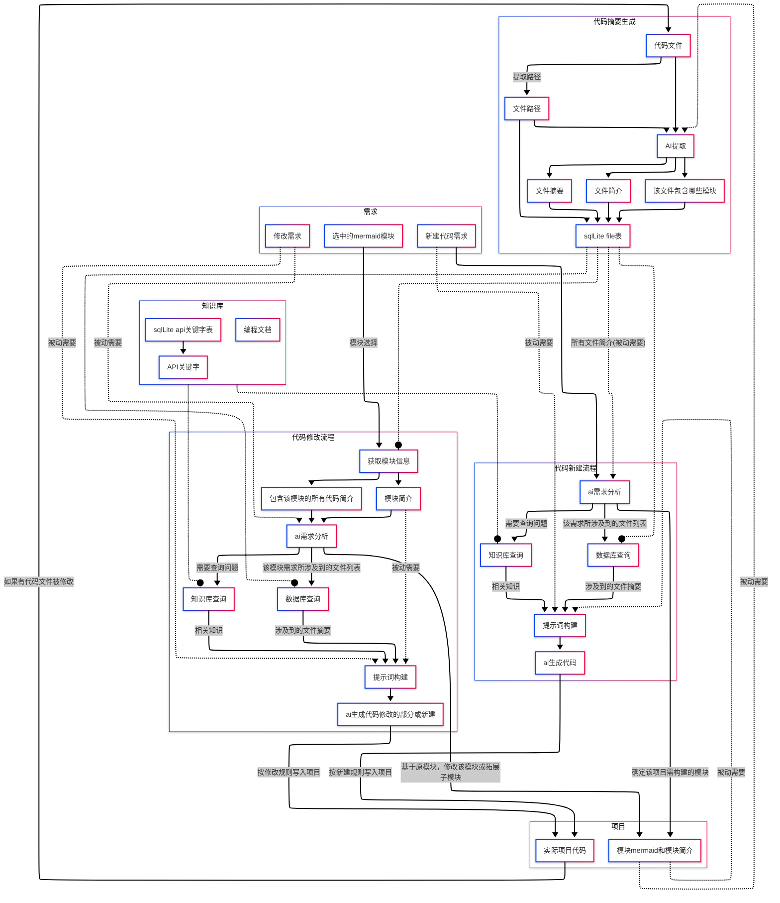

# AutoCode - 自动软件开发

一个RAG、代码智能摘要与模块可视化的一站式自动化开发工具，助力开发者偷懒。

---

```mermaid
---
config:
  theme: neo
  layout: elk
  look: neo
---
flowchart TD
 subgraph s1["代码摘要生成"]
        B["文件摘要"]
        A["代码文件"]
        C["文件路径"]
        D["sqlLite file表"]
        n1@{ label: "<span style=\"background-color:\">文件简介</span>" }
        n2["AI提取"]
        n8["该文件包含哪些模块"]
  end
 subgraph s2["代码新建流程"]
        G["知识库查询"]
        I["提示词构建"]
        J["ai生成代码"]
        n3["ai需求分析"]
        n4["数据库查询"]
  end
 subgraph s3["代码修改流程"]
        L["获取模块信息"]
        M["包含该模块的所有代码简介"]
        N["模块简介"]
        P["知识库查询"]
        Q["提示词构建"]
        n9["ai生成代码修改的部分或新建"]
        n10["ai需求分析"]
        n11["数据库查询"]
  end
 subgraph s4["知识库"]
        R["编程文档"]
        T["API关键字"]
        n5["sqlLite api关键字表"]
  end
 subgraph s5["需求"]
        E["新建代码需求"]
        O["修改需求"]
        K["选中的mermaid模块"]
  end
 subgraph s6["项目"]
        n6["实际项目代码"]
        n7["模块mermaid和模块简介"]
  end
    A -- 提取路径 --> C
    B --> D
    C --> D & n2
    E --> n3
    E -. 被动需要 .-> I
    G -- 相关知识 --> I
    I --> J
    K -- 模块选择 --> L
    L --> M & N
    N -. "<span style=color:>被动需要</span>" .-> Q
    P -- "<span style=color:>相关知识</span>" --> Q
    n1 --> D
    A --> n2
    n2 --> B & n1 & n8
    D -. "所有文件简介(<span style=color:>被动需要</span>)" .-> n3
    n3 -- "<span style=color:>需要查询问题</span>" --> G
    n3 -- "<span style=background-color:>该需求所涉及到的文件列表</span>" --> n4
    n4 -- 涉及到的文件摘要 --> I
    n5 --> T
    J -- 按新建规则写入项目 --> n6
    n6 -- 如果有代码文件被修改 --> A
    s4 -.-o G & P
    D -.-o n4 & L & n11
    n3 -- 确定该项目需构建的模块 --> n7
    n7 -. "<span style=color:>被动需要</span>" .-> I & n2
    n8 --> D
    Q --> n9
    n9 -- "<span style=color:>按修改规则写入项目</span>" --> n6
    M --> n10
    N --> n10
    n10 -- "<span style=color:>需要查询问题</span>" --> P
    O -. "<span style=color:>被动需要</span>" .-> n10 & Q
    n10 -- "<span style=color:>该</span><span style=color:>模块</span><span style=color:>需求所涉及到的文件列表</span>" --> n11
    n11 -- "<span style=color:>涉及到的文件摘要</span>" --> Q
    n10 -- 基于原模块，修改该模块或拓展子模块 --> n7
    n1@{ shape: rect}
    n2@{ shape: rect}
    n3@{ shape: rect}
    n4@{ shape: rect}
    n9@{ shape: rect}
    n10@{ shape: rect}
    n11@{ shape: rect}
    n7@{ shape: rect}
```
